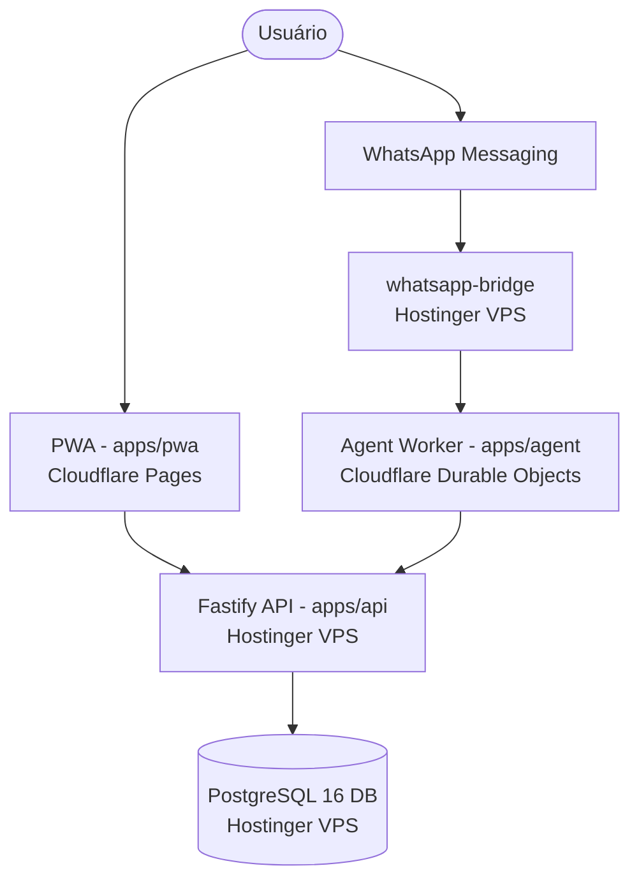

# PI Financeiro — Arquitetura Atual

**Last verified:** 2026-08-18  
**Reference:** [`runtime-facts.json`](architecture/runtime-facts.json)  

## 1. Visão Geral da Topologia

A arquitetura do PI Financeiro é composta por uma camada de apresentação PWA (Cloudflare Pages), assistente AI conversacional (Cloudflare Workers / Durable Objects) e um backend autoritativo Fastify com banco PostgreSQL 16 hospedado na Hostinger VPS.

## 2. Componentes e Responsabilidades

- **`apps/api` (Fastify + PostgreSQL):** Única fonte da verdade para dados financeiros. Gerencia autenticação, controle de acesso por workspace, integridade referencial e auditoria.
- **`apps/pwa` (Next.js / React):** Interface web/mobile canônica. Executa todas as operações financeiras por meio de rotas HTTP autenticadas com tokens de sessão.
- **`apps/agent` (Cloudflare Worker):** Runtime do assistente TED implementado sobre o Cloudflare Agents SDK com armazenamento de sessão em Durable Objects e execução de tools via adaptadores OpenAPI autoritativos.
- **`apps/whatsapp-bridge`:** Ponto de entrada de mensagens durante o período de transição e corte do canal legado.

## 3. Segurança e Identidade

- **Tokens Delegados de Curta Duração:** Operações conversacionais utilizam tokens assinados (HMAC-SHA256) emitidos após resolução de identidade do telefone via `POST /auth/bridge-context`.
- **Isolamento de Dados:** Cada consulta e mutação SQL é estritamente vinculada ao `workspace_id` correspondente.
- **Chaves de Idempotência:** Todas as rotas de mutação exigem e validam idempotência para prevenir lançamentos duplicados.
