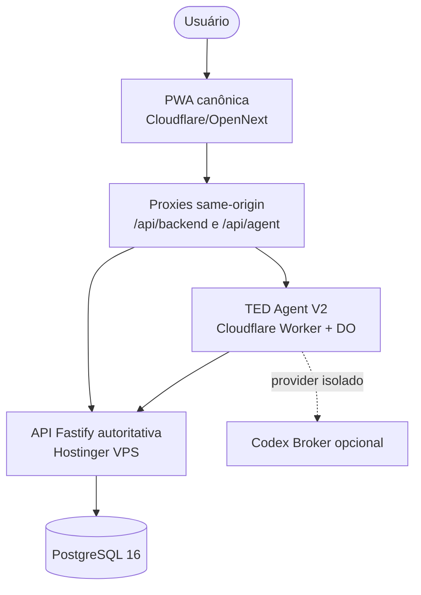

# Meu Ted — Arquitetura atual

**Last verified:** 2026-09-21
**Reference:** [`runtime-facts.json`](architecture/runtime-facts.json)

## Topologia implementada

## Responsabilidades e limites

- **API (`apps/api`):** única fonte da verdade financeira. Autentica,
  autoriza por workspace e aplica idempotência. Pending operations V2 são
  armazenadas e transitam aqui, vinculadas a `workspaceId`, `actorId` e
  `deviceId`; confirmação, execução, cancelamento, retry e expiração são
  rotas autoritativas com capability delegada específica.
- **PWA (`apps/pwa`):** aplica sessão e CSRF nos proxies same-origin. A
  autenticação online é session-first e cookie-only: o cookie de sessão é a
  autoridade e o token de dispositivo não substitui a sessão online. A UX do
  TED envia apenas uma decisão e um `requestId`; nunca envia/recebe
  atestação. Rotas V1 de aprovação direta não são utilizadas.
- **Agent (`apps/agent`):** todos os canais passam por
  `ConversationOrchestrator` e `TurnInput`. Router, evidências, resposta
  grounded, memória e observabilidade são internos. A SQLite do Durable
  Object contém apenas conversa/memória; não contém autoridade financeira.
- **MutationExecutor:** único consumidor/emissor de atestação no Agent e
  único cliente do ciclo de decisão V2. O provider/modelo não concede
  capability, aprovação ou write.
- **Codex Broker (`apps/codex-broker`):** container Node 22 non-root com
  healthcheck. Ele não possui acesso a PostgreSQL nem capability financeira.

## Segurança operacional

- Mutações financeiras exigem API autoritativa, capability estreita,
  binding de workspace/ator/dispositivo, proposta válida e idempotência.
- O sistema falha fechado se falta esquema, evidência, binding, capability,
  confirmação ou autoridade do provider.
- O Agent revalida a configuração/epoch do provider antes de publicar uma
  resposta; falha de upstream não produz sucesso sintético.
- O snapshot offline é V3: envelope com identidade opaca não-autenticadora
  (principal + workspace, vinculados somente após autenticação online
  confirmada pelo servidor), com migração V2→V3. A state machine de auth
  roteia `authenticated`→app, `unauthenticated`→login e
  `unreachable`→snapshot offline somente-leitura quando houver snapshot.
- Mutações keyed são fail-closed: com a transação de claim (`claimTx`)
  aberta, o efeito executa nessa transação; extensão `*InTx` ausente retorna
  o erro invariante `idempotency.atomic_mutation_not_supported`, nunca um
  fallback simples fora da claim.
- O CI exige `public-safety --strict` (warnings reprovam o gate) e os
  deploys verificam `head_repository` contra o repositório esperado,
  bloqueando execuções originadas de fork.
- A API web inicializa em modo verify-only. Migrations são executadas somente
  pelo job explícito documentado em `docs/runbooks/api-migration-v2.md`.

## Legado e estado de implantação

O `WorkspaceAgent` foi removido na V4 (ver
`docs/adr/ADR-016-workspace-agent-decommissioning.md`); não restam binding,
rota ou símbolo desse runtime — apenas a tag histórica de migração do
Durable Object no `wrangler.jsonc`, preservada por exigência da Cloudflare.
O WhatsApp Bridge e a extensão Pi foram removidos dos workspaces, CI e
runtime ativo. Na `main`, a imagem da API é publicada no GHCR por tag de
SHA com o digest imutável registrado como saída do job, e o manifesto do
Agent exige `lockfileHash` + `wranglerVersion` (deploy sem manifesto
completo é recusado). A implementação V2 foi validada localmente em 2026-09-13;
esta documentação não afirma deploy, migration ou alteração de segredos em
produção.
