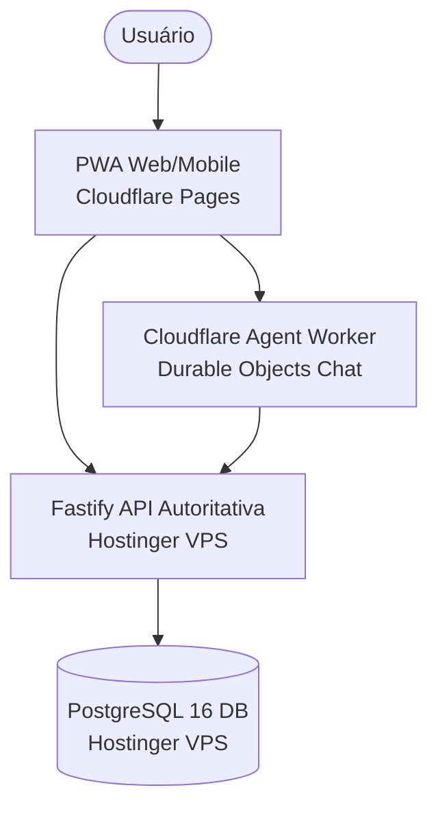

# PI Financeiro — Arquitetura Alvo

**Last verified:** 2026-08-18  
**Reference:** [`runtime-facts.json`](architecture/runtime-facts.json)  

## 1. Estado Alvo Pós-Transição

A arquitetura alvo consolida a remoção completa do bridge de mensageria intermediário e centraliza toda a experiência do usuário na PWA canônica e no Cloudflare Agent Worker.

## 2. Metas de Convergência

1. **Zero Dependência do WhatsApp:** Transição de 100% dos fluxos diários para a interface PWA e chat nativo na Cloudflare.
2. **Descomissionamento Total do Legado:** Conclusão da remoção física do container do bridge e arquivamento das extensões antigas.
3. **Observabilidade Unificada:** Métricas de latência e divergência consolidadas no dashboard operacional.
