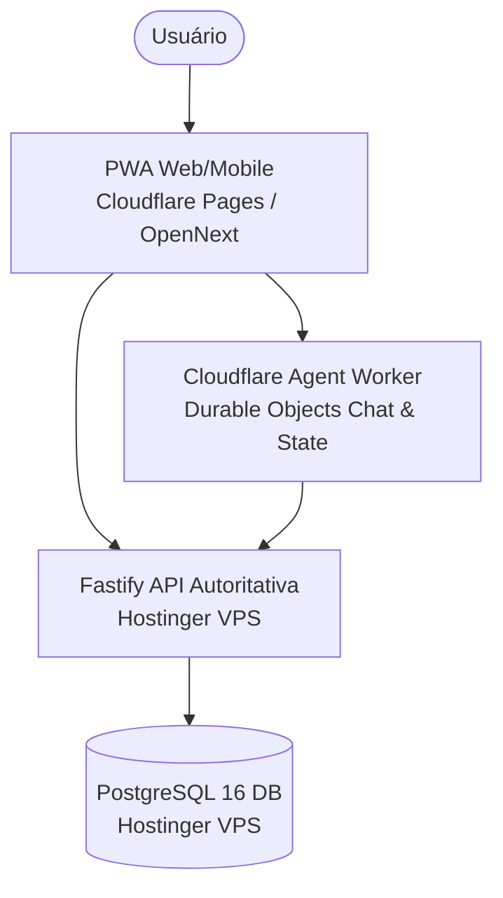

# PI Financeiro — Arquitetura Alvo

**Last verified:** 2026-08-23  
**Reference:** [`runtime-facts.json`](architecture/runtime-facts.json)  

## 1. Estado Alvo Pós-Transição

A arquitetura alvo consolida a remoção completa do bridge de mensageria intermediário e centraliza toda a experiência do usuário na PWA canônica (Cloudflare Pages) e no assistente financeiro AI TED (Cloudflare Agent Worker com Durable Objects), consumindo diretamente a API autoritativa na VPS.

## 2. Metas de Convergência & Modernização

1. **Zero Dependência do WhatsApp e Legado:** Transição de 100% das operações diárias para a PWA e chat nativo na Cloudflare, eliminando o container do `whatsapp-bridge` e adapters de schema antigo.
2. **Autenticação e Multi-Tenancy Unificados:** Acesso seguro via Better-Auth (email/senha e convites administrativos) com governança de workspaces server-side.
3. **Observabilidade e Auditoria Unificadas:** Monitoramento consolidado de latência, saúde do banco e auditoria imutável de transações financeiras.
4. **Isolamento de Borda e Dados:** Computação de borda ultrarrápida para interface e IA conversacional na Cloudflare combinada com persistência transacional ACID isolada na VPS.

