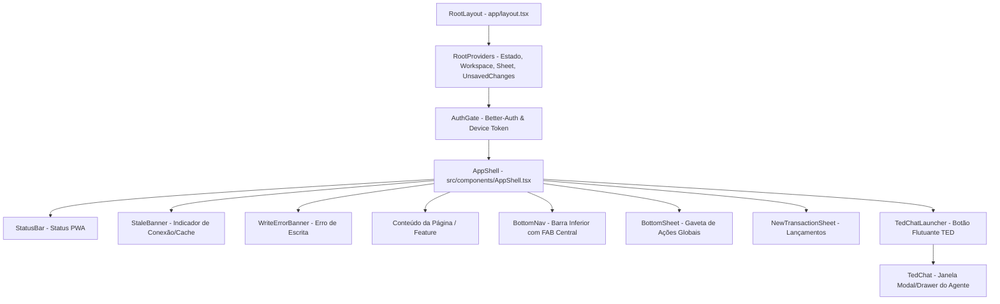

# Auditoria do Frontend Atual — `apps/pwa`

**Data da Auditoria:** 2026-08-28
**Autor:** Antigravity Coder (AGY)
**Contexto:** Run `run_58d4fa58d1bc` — Task 1: Auditoria do Front Atual para Redesign Premium Colaborativo
**Alvo:** `apps/pwa` (Next.js 16, React 19, Tailwind CSS v4, Serwist PWA)

---

## 1. Resumo Executivo

O frontend atual do **PI Financeiro** (`apps/pwa`) foi construído com foco em funcionalidade móvel rápida e desacoplada, servindo como PWA canônica após a migração arquitetural da Fase 0 e Fase 1 (onde foram consolidadas 8 features de paridade com 815+ testes unitários e de integração).

### Principais Pontos Fortes Encontrados
- **Fundação Técnica Sólida:** Next.js 16 (App Router), React 19, Tailwind CSS v4, suporte PWA offline via Serwist e comunicação autoritativa direta com a API Fastify (`https://api.synkroo.com.br`).
- **Segurança e Workspace:** Integração consistente com Better-Auth (`/auth/sign-in/email`, `/auth/devices/register`), persistência síncrona de tokens de dispositivo e alternância de workspace server-side (`WorkspaceSwitcher`).
- **Controle de Estado e Idempotência:** Contexto global de estado financeiro (`AppStateContext`) com suporte a tratamento de dirty forms (`useFormDirtySafe`), detecção de dados obsoletos (`StaleBanner`), duplicidades (`checkDuplicate`) e confirmação de descarte de alterações.

### Principais Oportunidades & Vulnerabilidades de UX/UI
1. **Ausência de um Design System Robusto / Componentes Headless:** Todos os inputs, botões, selects, tabs e modais são construídos manualmente via `<button>`, `<input>` e `<select>` com classes utilitárias duplicadas, sem padronização de focus-visible, acessibilidade ARIA ou transições de estado.
2. **Inconsistência de Design Tokens & Fragmentação Visual:** Enquanto o core do app utiliza tokens customizados em `globals.css` (verde esmeralda, bege neutro), o assistente conversacional **TED Chat** (`apps/pwa/src/features/ted/`) utiliza a paleta padrão do Tailwind (`slate-900`, `emerald-600`, `rose-50`, `teal-700`), criando uma quebra visual abrupta.
3. **Ausência de Dark Mode:** O sistema opera exclusivamente em Light Mode com fundo fixo `#F7F8F5`, não suportando preferências de sistema (`prefers-color-scheme`) nem chaveamento manual de tema.
4. **Layout Desktop Restrito a Coluna Estreita:** O design adota `--shell-max-w: 430px|640px|860px`, mas não aproveita o espaço em telas grandes (desktop/tablet), mantendo a Bottom Navigation fixa e cards esticados verticalmente em vez de um layout desktop nativo com sidebar e grid responsivo (Bento Grid).
5. **Relíquias Legadas de Marca (WhatsApp):** Foram identificados textos e links legados referenciando o antigo modelo WhatsApp em `layout.tsx` e `ProfilePage.tsx` (`ChatSheet`), em desacordo com a arquitetura canônica pós-P3 baseada no TED Chat integrado.

---

## 2. Inventário Estruturado do Frontend

### 2.1. Rotas e Páginas (`apps/pwa/src/app/*`)

| Rota | Arquivo Next.js | Componente de Feature | Descrição e Propósito |
| :--- | :--- | :--- | :--- |
| `/` | `app/page.tsx` | `HomePage` | Dashboard principal: Saldo total, mini-stats de receitas/despesas, KPI deltas, resumo de contas, cartões, contas a pagar, donut de categorias e insights. |
| `/registros` | `app/registros/page.tsx` | `RecordsPage` | Extrato de transações com busca textual, filtros por tipo (despesa/receita/transferência), período e categoria, agrupamento por data e edição/exclusão. |
| `/a-pagar` | `app/a-pagar/page.tsx` | `PayablesPage` | Gestão de contas a pagar: vencidas, próximas e pagas, liquidação e cancelamento de lançamentos. |
| `/cartoes` | `app/cartoes/page.tsx` | `CardsPage` | Gestão de cartões de crédito, visualização de faturas abertas/fechadas, detalhamento de compras e pagamento integral/parcial de faturas. |
| `/contas` | `app/contas/page.tsx` | `AccountsPage` | Listagem e criação de contas correntes, investimentos e dinheiro, histórico recente e desativação. |
| `/orcamentos` | `app/orcamentos/page.tsx` | `BudgetsPage` | Definição de limites mensais por categoria de despesa e previsão de receitas, com barra de progresso em tempo real baseada em transações. |
| `/metas` | `app/metas/page.tsx` | `GoalsPage` | Metas de poupança/reserva/compra e controle de dívidas parceladas com grid de parcelas pagas/pendentes. |
| `/patrimonio` | `app/patrimonio/page.tsx` | `WalletPage` | Visão consolidada de patrimônio líquido (ativos vs passivos), somando contas, metas, faturas e dívidas. |
| `/assinaturas` | `app/assinaturas/page.tsx` | `SubscriptionsPage` | Acompanhamento de serviços recorrentes (Netflix, Spotify, etc.), custos mensais agregados e controle de ciclo de cobrança. |
| `/categorias` | `app/categorias/page.tsx` | `CategoriesPage` | Hierarquia de categorias e subcategorias de receitas e despesas. |
| `/pending` / `/pendentes` | `app/pending/page.tsx` | `PendingOperationsPage` | Aprovação/rejeição de operações financeiras de alto valor ou destrutivas, e botão de `Desfazer última ação` (`undoLastAction`). |
| `/alerts/price` | `app/alerts/price/page.tsx` | `PriceAlertsPage` | Monitoramento e cadastro de alertas de preço de produtos com condições de gatilho (abaixo/acima de valor alvo). |
| `/audit` | `app/audit/page.tsx` | `AuditPage` | Consulta de trilha imutável de auditoria com filtros por tipo de entidade, ID, operação e ator (`user`/`device`). |
| `/perfil` | `app/perfil/page.tsx` | `ProfilePage` | Perfil do usuário, preferências de saudação, configurações LLM para admins, notificações Web Push e logout seguro. |
| `/capture` | `app/capture/page.tsx` | `CaptureBridge` | Ponto de entrada PWA Web Share Target / deep-link para captura rápida de transações via parâmetros URL. |

---

### 2.2. Componentes de Shell e Layout Global



- **`AppShell.tsx`**: Contêiner global centralizado (`max-w-[var(--shell-max-w)]`). Gerencia a abertura das gavetas de novo lançamento (`NewTransactionSheet`), menu "Mais", diálogo de descarte de alterações não salvas (`ConfirmActionDialog`) e renderiza o lançador do TED Chat.
- **`BottomNav.tsx`**: Barra de navegação inferior estilo mobile com 4 slots ("Resumo", "Registros", "A pagar", "Mais") e um botão de ação rápida (FAB central com gradiente verde) para registrar despesas/receitas/transferências.
- **`PageHeader.tsx`**: Cabeçalho de página padronizado com título, subtítulo opcional, botão compacto de alternância de workspace (`WorkspaceSwitcher`) e slot para ações primárias.
- **`BottomSheet.tsx`**: Gaveta deslizante inferior construída com animação CSS `@keyframes sheetUp`, overlay escuro com backdrop click, trava de scroll no body e suporte a tecla `Escape`.
- **`ConfirmActionDialog.tsx`**: Modal de confirmação para ações destrutivas (exclusões, cancelamentos e descarte de formulários sujos).
- **`WorkspaceSwitcher.tsx`**: Seletor e dropdown de household/workspace multitenant.

---

### 2.3. Componentes de UI Reutilizáveis (`src/components/ui/*`)

- **`Badge.tsx`**: Chip identificador com cor de fundo translúcida (`hexToRgba(color, 0.14)`), tipografia mono (`Space Grotesk`) e geração automática de sigla de 2 caracteres baseada no nome (ex: "Nubank" → "NU", "Cartão Itaú" → "CI").
- **`CategoryBadge.tsx`**: Círculo colorido determinístico para categorias baseado no hash do nome da categoria, exibindo a inicial em caixa alta.
- **`Icon.tsx`**: Registro compartilhado de ícones vetoriais SVG desenhados manualmente (24x24 viewBox, strokeWidth=1.9), cobrindo 27 ícones inline (`home`, `records`, `credit-card`, `wallet`, `trend-up`, `alert-triangle`, etc.).
- **`Skeleton.tsx`**: Componente de placeholder de carregamento animado com pulsos (`animate-pulse`), suportando variantes `block`, `text`, `circle` e `card` com atributos de acessibilidade (`role="status"`, `aria-label="Carregando"`).

---

## 3. Design Tokens & Maturidade do Design System

### 3.1. Código Literal dos Tokens (`apps/pwa/src/app/globals.css`)

```css
@import "tailwindcss";

/* ── Design Token Theme (Tailwind v4) ── */
@theme {
  /* Primárias */
  --color-primary: #0E8C5A;
  --color-primary-dark: #0A3A28;
  --color-primary-mid: #0F6B45;
  --color-primary-light: #2FA56F;
  --color-primary-tint: #E7F3EC;

  /* Semânticas */
  --color-danger: #C8483B;
  --color-danger-tint: #F7E9E7;
  --color-warning: #B8791F;
  --color-warning-tint: #FBF1E3;
  --color-info: #3E6FB0;
  --color-info-tint: #E8EFF7;

  /* Neutros */
  --color-bg: #F7F8F5;
  --color-surface: #FFFFFF;
  --color-border: #ECEEEA;
  --color-border-strong: #E0E3DE;
  --color-text-primary: #16201A;
  --color-text-secondary: #5C665E;
  --color-text-muted: #98A29A;
  --color-fill-light: #F4F5F2;
  --color-fill-medium: #F1F3EF;

  /* Fontes */
  --font-ui: var(--font-plus-jakarta-sans), "Plus Jakarta Sans", sans-serif;
  --font-mono: var(--font-space-grotesk), "Space Grotesk", monospace;

  /* Sombras */
  --shadow-card: 0 1px 3px rgba(0,0,0,.06);
  --shadow-sheet: 0 -4px 24px rgba(10,30,20,.12);
  --shadow-fab: 0 4px 18px rgba(14,140,90,.35);

  /* Animações */
  --animate-sheet-up: sheetUp 0.28s cubic-bezier(.2,.8,.2,1);
  --animate-fade-in: fadeIn 0.25s ease;
}

:root {
  --page-padding: 20px;
  --page-pt: 14px;
  --page-pb: 24px;
  --tab-bar-height: 72px;
  --status-bar-h: 44px;
  --card-radius: 16px;
  --sheet-radius: 26px 26px 0 0;
  --btn-radius: 100px;
  --input-radius: 13px;
  --chip-radius: 100px;
  --easing-standard: cubic-bezier(.2,.8,.2,1);
  --duration-standard: 0.28s;
  --shell-max-w: 430px;
}

@media (min-width: 640px) {
  :root {
    --shell-max-w: 640px;
    --page-padding: 28px;
  }
}

@media (min-width: 860px) {
  :root {
    --shell-max-w: 860px;
    --page-padding: 40px;
  }
}
```

### 3.2. Configuração de Tipografia (`apps/pwa/src/app/layout.tsx`)

```tsx
const plusJakartaSans = Plus_Jakarta_Sans({
  subsets: ["latin"],
  weight: ["400", "500", "600", "700", "800"],
  variable: "--font-plus-jakarta-sans",
});

const spaceGrotesk = Space_Grotesk({
  subsets: ["latin"],
  weight: ["400", "500", "600", "700"],
  variable: "--font-space-grotesk",
});
```

### 3.3. Avaliação da Maturidade dos Tokens

| Dimensão | Estado Atual | Avaliação | Diagnóstico |
| :--- | :--- | :---: | :--- |
| **Paleta de Cores** | 5 tons de verde, 3 semânticas com tint, 9 neutros | ⚠️ Regular | As cores base são elegantes, mas há dezenas de cores hardcoded espalhadas pelo código (`#820AD1`, `#EC7000`, `#7FE3B0`, `#F9A8A2`, `#1A1A1A`, `#25D366`) em vez de tokens semânticos centralizados. |
| **Tipografia** | Plus Jakarta Sans (UI) e Space Grotesk (Mono/Números) | 🟢 Boa | A combinação de fontes é excelente e transmite ar moderno de fintech. Porém, os tamanhos e leading são arbitrários (`text-[11.5px]`, `text-[13px]`, `text-[15px]`). |
| **Espaçamento e Raios** | Variáveis CSS em `:root` (`--card-radius: 16px`, `--btn-radius: 100px`) | ⚠️ Regular | Raios são misturados: alguns elementos usam `rounded-[14px]`, outros `rounded-[16px]`, `rounded-[12px]` ou `rounded-full`. Falta uma escala uniforme (sm: 8px, md: 12px, lg: 16px, xl: 24px). |
| **Sombras e Profundidade** | 3 sombras básicas no `@theme` | 🔴 Fraca | Falta profundidade e acabamento premium (sombras difusas, elevações multicamadas, bordas luminosas de 1px com `border-white/10` ou `ring-1 ring-black/5`). |
| **Modos de Cor (Dark Mode)** | Inexistente (Fixo em Light `#F7F8F5`) | 🔴 Inexistente | Não há tokens dinâmicos via CSS variables para alternância claro/escuro. |
| **Unificação com o Chat TED** | Chat TED usa classes padrão do Tailwind (`slate-900`, `emerald-600`) | 🔴 Crítico | Quebra total de identidade entre o shell da aplicação e a janela do assistente AI. |

---

## 4. Stack Visual e Bibliotecas Instaladas

Auditoria de dependências em `apps/pwa/package.json`:

```json
{
  "dependencies": {
    "@serwist/next": "9.5.11",
    "@serwist/precaching": "9.5.11",
    "@serwist/sw": "9.5.11",
    "agents": "^0.2.0",
    "ai": "^5.0.0",
    "@cloudflare/ai-chat": "^0.1.0",
    "@ai-sdk/react": "^2.0.0",
    "next": "16.2.12",
    "react": "19.2.4",
    "react-dom": "19.2.4",
    "serwist": "9.5.11",
    "zod": "^3.24.1"
  },
  "devDependencies": {
    "@tailwindcss/postcss": "^4",
    "tailwindcss": "^4",
    "typescript": "^5",
    "vitest": "^4.1.10"
  }
}
```

### Análise da Stack
- **Tailwind CSS v4 & React 19:** Stack ultra moderna e rápida, compilada via `@tailwindcss/postcss`.
- **Ausência de Bibliotecas UI Externas:**
  - ❌ **Sem Radix UI / Headless UI / shadcn/ui**: Todos os modais, dropdowns, tooltips e diálogos são criados do zero com `div` e `fixed inset-0`.
  - ❌ **Sem Lucide React**: Ícones são desenhados individualmente em SVG inline ou em `Icon.tsx`.
  - ❌ **Sem Framer Motion / Motion**: Animações limitam-se a transições CSS simples e `@keyframes` manuais.
  - ❌ **Sem Biblioteca de Gráficos (Recharts / Chart.js)**: Gráficos de fluxo e donuts utilizam `conic-gradient` no CSS e elementos `<svg>` montados manualmente via strings.

---

## 5. Brand e Identidade do Produto

Conforme os documentos canônicos `docs/PRODUCT.md` e `docs/ARCHITECTURE-CURRENT.md`:

1. **Propósito:** Plataforma de gestão financeira pessoal e familiar, garantindo controle rigoroso de caixa, orçamentos, faturas de cartão e metas patrimoniais, unificada a um assistente inteligente (TED).
2. **Tom e Sensação do Produto:** Confiável, ágil, matematicamente preciso (centavos BRL), colaborativo por família/workspace e moderno.
3. **Relíquias Identificadas que Devem Ser Removidas no Redesign:**
   - `apps/pwa/src/app/layout.tsx` (L23): `description: "Controle financeiro pessoal via WhatsApp"` ❌ (deve ser atualizado para PWA / Assistente TED).
   - `apps/pwa/src/features/profile/ProfilePage.tsx` (L410-454): `ChatSheet` ainda renderiza botão `"Abrir no WhatsApp"` e link `https://wa.me/5511999999999` em vez de integrar com o assistente TED nativo.

---

## 6. UX/UI Gaps Priorizados

### 🔴 P0 — Críticos (Usabilidade, Consistência Básica e Identidade)

1. **Inconsistência de Tokens entre o TED Chat e o Resto da Aplicação:**
   - *Evidência:* `TedChat.tsx` usa `bg-slate-900/40`, `bg-gradient-to-br from-emerald-600 to-teal-700`, `ring-emerald-200`, `bg-rose-50`, enquanto o app usa `bg-bg`, `bg-surface`, `bg-primary`, `bg-danger-tint`.
   - *Impacto:* O assistente TED parece um widget de terceiros colado sobre a interface, em vez de ser o coração integrado do produto.
2. **Falta de Dark Mode e Sistema de Temas:**
   - *Evidência:* Fundo branco/bege `#F7F8F5` estático em `globals.css` sem variáveis CSS intercambiáveis ou suporte a `@media (prefers-color-scheme: dark)`.
   - *Impacto:* Experiência visual cansativa à noite e falta de percepção premium comum em fintechs contemporâneas (Nubank, Revolut, Mercury).
3. **Ausência de Componentes Base Padronizados (Botões, Inputs, Dialogs):**
   - *Evidência:* Cada formulário (`NewTransactionSheet`, `NewPayableSheet`, `NewCardSheet`, `AuthGate`) redefine seus próprios `<input>`, `<button>` e `<select>` com classes utilitárias arbitrárias (`px-3.5 py-3`, `px-3 py-2.5`, `rounded-[10px]`, `rounded-[13px]`, `rounded-[14px]`).
   - *Impacto:* Comportamentos inconsistentes de foco, padding, tamanhos de fonte e estados de erro.
4. **Relíquias do WhatsApp em Telas e Metadados:**
   - *Evidência:* `layout.tsx` e `ProfilePage.tsx` ainda mencionam integração via WhatsApp que foi descontinuada em P3.

---

### 🟡 P1 — Importantes (Experiência, Densidade e Responsividade)

1. **Layout Desktop Subutilizado (Mobile Esticado no Centro):**
   - *Evidência:* O `AppShell` restringe a largura a 430px/640px/860px no centro da tela com a `BottomNav` presa na base, deixando grandes áreas vazias nas laterais em monitores desktop.
   - *Impacto:* Usuários em desktop têm uma experiência de "emulador de celular" em vez de um painel financeiro rico com sidebar e visualização em grade (Bento Grid).
2. **Ausência de Ícones Padronizados com Stroke Consistente:**
   - *Evidência:* Ícones SVG desenhados inline em dezenas de arquivos (`BottomNav.tsx`, `HomePage.tsx`, `CardsPage.tsx`, `Icon.tsx`) com pequenas variações de `strokeWidth` (1.6 a 2.8) e `viewBox`.
   - *Impacto:* Falta de coesão visual e manutenção difícil.
3. **Formulários e Inputs Numéricos BRL Artesanais:**
   - *Evidência:* Funções duplicadas `formatInputBRL` e `parseBRLToCents` espalhadas por 8 arquivos diferentes.
   - *Impacto:* Duplicação de lógica e inconsistências na digitação de centavos no teclado mobile.
4. **Gráficos e Visualizações Básicas:**
   - *Evidência:* Gráficos em `HomePage` e `ReportsPage` desenhados via SVG puro sem tooltips interativas ao passar o cursor ou tocar.
   - *Impacto:* Baixa capacidade exploratória dos dados financeiros para o usuário.

---

### 🔵 P2 — Polimento Premium & Delight (Micro-interações e Acabamento)

1. **Micro-interações e Feedback Háptico/Visual:**
   - Ausência de animações de transição suaves ao abrir sheets, trocar de abas ou confirmar lançamentos financeiros.
2. **Empty States sem Ilustrações ou Ações Claras:**
   - Páginas vazias (ex: sem contas, sem dívidas, sem alertas) exibem apenas textos simples em cinza ("Nada encontrado") em vez de ilustrações elegantes ou botões diretos de ação rápida.
3. **Feedback de Loading e Skeletons Heterogêneos:**
   - Algumas páginas possuem Skeletons bem estruturados (`HomePage`, `RecordsPage`), enquanto outras usam spinners circulares genéricos (`PayablesPage`, `CardsPage`, `AccountsPage`).

---

## 7. Propostas de Direções de Design Premium

Com base no perfil do PI Financeiro — que une **rigor contábil**, **controle familiar colaborativo** e **inteligência artificial em tempo real** —, apresentamos 4 direções conceituais de design para debate e execução:

---

### Direção 1: Dark-First Fintech Titanium (Recomendada para Visual Premium)
*Inspirado em: Apple Card, Linear, Nubank Ultravioleta, Revolut Ultra*

- **Conceito:** Fundo escuro profundo e aveludado (`#0B0F0E` a `#121816`), superfícies em camadas com cinza carvão (`#1A221E`), bordas ultrafinas com brilho sutil (`rgba(255,255,255,0.08)`) e acentos em **Verde Esmeralda Luminescente** (`#10B981` / `#00E599`).
- **Tipografia:** Números em Space Grotesk com alto contraste e peso marcante, rótulos refinados em Plus Jakarta Sans.
- **Acabamento:** Cards com leve gradiente radial, micro-glow verde ao redor do widget do TED e botões com reflexo metálico.
- **Justificativa:** Transmite sensação imediata de exclusividade, modernidade e sofisticação tecnológica para o usuário.

```
┌────────────────────────────────────────────────────────┐
│  PI FINANCEIRO                     [Workspace: Família]│
│                                                        │
│  PATRIMÔNIO LÍQUIDO                                    │
│  R$ 148.920,50  ▲ +4.2% este mês                       │
│                                                        │
│  ┌──────────────────┐ ┌──────────────────┐ ┌─────────┐ │
│  │ Saldo Contas     │ │ Faturas Cartão   │ │ Metas   │ │
│  │ R$ 34.120,00     │ │ R$ 4.210,80      │ │ 78%     │ │
│  └──────────────────┘ └──────────────────┘ └─────────┘ │
│                                                        │
│  [ TED: "Você economizou R$ 850 a mais que no mês ant."]│
└────────────────────────────────────────────────────────┘
```

---

### Direção 2: Clean Editorial Modern Fintech (Light-First Alta Clareza)
*Inspirado em: Stripe Dashboard, Mercury Bank, Wise, Monzo*

- **Conceito:** Interface clara, arejada e hiper-legível. Fundo branco puro (`#FFFFFF`) e off-white frio (`#F8F9FA`), bordas cinza neutras nítidas (`#E5E7EB`), tipografia de alto contraste com preto profundo (`#0F172A`) e verde floresta corporativo (`#0E8C5A`).
- **Tipografia:** Hierarquia editorial forte, títulos elegantes e números tabulares alinhados com precisão suíça.
- **Acabamento:** Sombras suaves em camadas (`0 1px 2px rgba(0,0,0,0.05), 0 4px 12px rgba(0,0,0,0.03)`), badges com cores pastel suaves e dados estruturados em tabelas compactas e limpas.
- **Justificativa:** Ideal para usuários focados em produtividade, auditoria detalhada e leitura rápida de extratos sem distrações visuais.

---

### Direção 3: Adaptive Neo-Glass Hybrid (Bento Grid & Multi-Plataforma)
*Inspirado em: iOS 18, macOS Sequoia, Raycast, Vercel*

- **Conceito:** Design dinâmico com suporte nativo e automático a **Light & Dark Mode**. No mobile opera como aplicativo nativo touch-friendly com gavetas fluidas; no desktop/tablet expande-se em um painel **Bento Grid** modular com sidebar expansível.
- **Acabamento:** Efeito acrílico / glassmorphism refinado (`backdrop-blur-md`, superfícies semi-translúcidas `rgba(255,255,255,0.75)` / `rgba(18,24,22,0.75)`), anéis de foco coloridos e cantos arredondados contínuos (squircle).
- **Justificativa:** Oferece a melhor flexibilidade para quem usa o PI Financeiro tanto no smartphone no dia a dia quanto no computador para planejamento financeiro mensal aprofundado.

---

### Direção 4: Emerald Private Banking (Luxury Minimalist)
*Inspirado em: Brex Private, Julius Bär, American Express Centurion*

- **Conceito:** Visual clássico e luxuoso de private banking, combinando verde esmeralda escuro nobre (`#0A3A28`), detalhes dourados champagne fosco (`#D4AF37` / `#C5A059`) e fundos em tom papel premium (`#FDFDFB`).
- **Tipografia:** Toque contemporâneo refinado com ênfase em serenidade visual.
- **Justificativa:** Excelente para posicionar o produto como um co-piloto de gestão de patrimônio e finanças familiares de alto padrão.

---

## 8. Recomendações Técnicas para a Próxima Fase (Plano de Execução)

1. **Estruturação de Primitives de UI com Tailwind v4 (`src/components/ui/`):**
   - Criar componentes atômicos padronizados: `Button` (variantes `primary`, `secondary`, `outline`, `ghost`, `danger`), `Input`, `Select`, `Card`, `Modal`/`Dialog`, `Tabs`, `Drawer`/`Sheet`.
2. **Biblioteca de Ícones Padronizada:**
   - Adotar **Lucide React** (`lucide-react`) para eliminar ícones SVG manuais e garantir consistência estética em todas as telas.
3. **Unificação Total do TED Chat:**
   - Refatorar `TedChat.tsx` e `TedMessage.tsx` para consumir 100% dos novos tokens do design system.
4. **Camada de Temas Dinâmicos (Light & Dark):**
   - Configurar CSS variables com chaveamento via classe `.dark` ou `data-theme` no `html`.
5. **Limpeza de Relíquias de Marca:**
   - Atualizar metadados do PWA em `layout.tsx` e substituir o `ChatSheet` do WhatsApp por acesso direto ao TED Chat no `ProfilePage.tsx`.

---
*Relatório de auditoria pronto para subsidiar o debate e o plano de redesign do Planner e Coder.*
