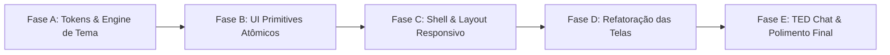

# Plano de Redesign Premium — Meu Ted
## Direção: *Emerald Titanium (Adaptive Fintech Premium)*

**Data de Consolidação:** 2026-08-28
**Participantes:** OpenCode Planner & Antigravity Coder (AGY)
**Documento de Origem:** [`docs/design/audit-front-current.md`](audit-front-current.md)
**Status:** CONSOLIDADO & APROVADO PARA EXECUÇÃO

---

## 1. Visão Geral & Filosofia da Direção

A direção **Emerald Titanium (Adaptive Fintech Premium)** une a estética dark sofisticada e de alta tecnologia de fintechs de ponta (*Apple Card, Linear, Nubank Ultravioleta*) com a flexibilidade multi-plataforma e adaptativa de sistemas operacionais modernos (*macOS Sequoia, iOS 18, Raycast*).

### Princípios de Design
1. **Dark-First com Light Adaptativo de Primeira Classe:** A experiência padrão é um tema escuro aveludado com contraste refinado, mas com suporte completo ao tema claro via `prefers-color-scheme` e alternância manual persistida. Nunca invertemos cores mecanicamente; cada modo possui sua própria escala semântica ajustada.
2. **Números como Cidadãos de Primeira Classe:** Valores financeiros são a razão de ser da aplicação. Todos os números utilizam `Space Grotesk` com algarismos tabulares de largura fixa (`font-feature-settings: "tnum" 1`), alinhamento rigoroso e escala de destaque visual.
3. **Fluidez Mobile & Poder Desktop (Bento Grid):** No smartphone, o app é touch-first com gavetas inferiores fluidas e navegação rápida por polegar. Em telas grandes (desktop e tablets >=860px), o layout expande-se organicamente para um painel em Bento Grid com barra de navegação lateral (Sidebar Rail) e widgets modulares.
4. **Coesão Total com o Assistente TED:** O co-piloto financeiro conversacional (TED) compartilha exatamente os mesmos tokens, superfícies, tipografia e elevações do restante da aplicação, eliminando a sensação de widget desconectado.
5. **Leveza e Desempenho PWA na Borda:** Manter zero dependências desnecessárias para garantir carregamento instantâneo no Service Worker (Serwist) e limites de bundle da Cloudflare.

---

## 2. Debate Técnico & Decisões Arquiteturais

| Tópico Debatido | Proposta do Planner | Posição do Coder (AGY) | Decisão Final Consolidada |
| :--- | :--- | :--- | :--- |
| **Dark Mode & Anti-Flicker** | Dark-first com toggle manual + sistema. | **Aprovado com ressalva:** Evitar FOUC (Flash of Unstyled Content) inserindo um script inline anti-flicker no `<head>` do `layout.tsx` lendo `localStorage` antes da hidratação do React. | Script inline anti-flicker no `<head>` + context provider `ThemeProvider` + classes `.dark` / `.light` no elemento `<html>`. |
| **Adoção de Ícones** | Avaliar `lucide-react` vs manter `Icon.tsx`. | **Decisão pró-`lucide-react`:** O Next.js 16/Webpack realiza tree-shaking estrito. Os ~35 ícones utilizados pesam ~15kB gzipped, eliminando 27 SVGs inline manuais e inconsistências de traço/stroke. | **Adotar `lucide-react`** como padrão de ícones em todo o monorepo. |
| **Biblioteca de UI Headless** | Avaliar Radix UI vs Hand-rolled Primitives. | **Decisão pró-Hand-rolled:** Radix adiciona dezenas de pacotes e peso ao bundle. Nossos primitives locais em TypeScript/React 19 (`Dialog`, `Sheet`, `Dropdown`, `Tabs`) são leves, 100% controláveis e acessíveis via WAI-ARIA nativo. | **Desenvolver Primitives Próprios** em `src/components/ui/` com zero-runtime overhead e foco em acessibilidade e performance PWA. |
| **Contraste de Acessibilidade** | Saturar cores semânticas no dark mode. | **Aprovado com validação WCAG:** Cores no dark mode devem atender à taxa mínima de contraste 4.5:1 (AA) para textos e 3:1 para componentes e bordas ativas. | Paletas semânticas calibradas especificamente para fundo escuro (`#0B0F0E`) e claro (`#F8F9FA`). |
| **Layout Desktop** | Transição para Bento Grid em telas >=860px. | **Aprovado:** A BottomNav oculta em `>=860px`, dando lugar a um Sidebar Rail lateral fixo e grid responsivo de cards assimétricos. | Implementar Bento Grid no `AppShell` preservando compatibilidade com testes legados via atributos `data-shell="root"` e `data-nav="bottom"`. |

---

## 3. Especificação Completa dos Design Tokens

### 3.1. Paleta de Cores & Variáveis CSS

Os tokens semânticos serão definidos em `apps/pwa/src/app/globals.css` utilizando a diretiva `@theme` do Tailwind CSS v4 acoplada a variáveis CSS dinâmicas:

```css
@import "tailwindcss";

:root {
  /* ── Light Mode (Canvas Claro Refinado) ── */
  --bg-canvas: #F8F9FA;
  --surface-1: #FFFFFF;
  --surface-2: #F1F3EF;
  --surface-3: #E9ECE5;
  --surface-4: #E0E4DC;

  --border-subtle: #ECEEEA;
  --border-medium: #E0E3DE;
  --border-strong: #CDD1CA;

  --text-primary: #111814;
  --text-secondary: #4B554E;
  --text-muted: #828E85;

  /* Primárias Esmeralda */
  --primary: #0E8C5A;
  --primary-hover: #0B734A;
  --primary-light: #2FA56F;
  --primary-glow: rgba(14, 140, 90, 0.15);
  --primary-tint: #E7F3EC;

  /* Money Accent (Luminescente) */
  --accent-money: #10B981;
  --accent-money-glow: rgba(16, 185, 129, 0.20);

  /* Semânticas */
  --danger: #C8483B;
  --danger-tint: #FCECEB;
  --warning: #B8791F;
  --warning-tint: #FEF6EB;
  --info: #3E6FB0;
  --info-tint: #EFF4FA;
  --success: #0E8C5A;
  --success-tint: #E7F3EC;

  /* Sombras Light */
  --shadow-sm: 0 1px 2px rgba(0, 0, 0, 0.04);
  --shadow-card: 0 1px 3px rgba(0, 0, 0, 0.05), 0 4px 12px rgba(0, 0, 0, 0.02);
  --shadow-elevated: 0 8px 24px rgba(0, 0, 0, 0.08), 0 2px 6px rgba(0, 0, 0, 0.04);
  --shadow-sheet: 0 -4px 32px rgba(10, 30, 20, 0.12);
  --shadow-fab: 0 4px 18px rgba(14, 140, 90, 0.35);
}

.dark {
  /* ── Dark Mode (Titanium Velvet) ── */
  --bg-canvas: #0B0F0E;
  --surface-1: #131916;
  --surface-2: #1A231F;
  --surface-3: #222E29;
  --surface-4: #2B3A34;

  --border-subtle: rgba(255, 255, 255, 0.06);
  --border-medium: rgba(255, 255, 255, 0.10);
  --border-strong: rgba(255, 255, 255, 0.18);

  --text-primary: #F3F5F2;
  --text-secondary: #9DA8A0;
  --text-muted: #667269;

  /* Primárias Esmeralda Dark */
  --primary: #10B981;
  --primary-hover: #059669;
  --primary-light: #34D399;
  --primary-glow: rgba(16, 185, 129, 0.25);
  --primary-tint: rgba(16, 185, 129, 0.12);

  /* Money Accent (Luminescente Dark) */
  --accent-money: #00E599;
  --accent-money-glow: rgba(0, 229, 153, 0.30);

  /* Semânticas Dark */
  --danger: #F87171;
  --danger-tint: rgba(248, 113, 113, 0.14);
  --warning: #FBBF24;
  --warning-tint: rgba(251, 191, 36, 0.14);
  --info: #60A5FA;
  --info-tint: rgba(96, 165, 250, 0.14);
  --success: #34D399;
  --success-tint: rgba(52, 211, 153, 0.14);

  /* Sombras Dark */
  --shadow-sm: 0 1px 2px rgba(0, 0, 0, 0.3);
  --shadow-card: 0 1px 3px rgba(0, 0, 0, 0.4), 0 4px 16px rgba(0, 0, 0, 0.3);
  --shadow-elevated: 0 8px 32px rgba(0, 0, 0, 0.6), 0 0 0 1px rgba(255, 255, 255, 0.08);
  --shadow-sheet: 0 -4px 40px rgba(0, 0, 0, 0.7);
  --shadow-fab: 0 4px 20px rgba(16, 185, 129, 0.40);
}
```

---

### 3.2. Escala Tipográfica & Configuração

| Nome do Token | Tamanho / Leading | Peso | Fonte | Aplicação Típica |
| :--- | :--- | :--- | :--- | :--- |
| `display-lg` | 44px / 1.05 | 700 (Bold) | Space Grotesk (`tnum`) | Saldo Total no Hero, Patrimônio Líquido |
| `display-md` | 32px / 1.10 | 700 (Bold) | Space Grotesk (`tnum`) | Entradas/Saídas principais, Faturas |
| `heading-xl` | 24px / 1.20 | 700 (Bold) | Plus Jakarta Sans | Títulos de página de destaque |
| `heading-lg` | 20px / 1.25 | 600 (Semibold) | Plus Jakarta Sans | Títulos de seções, cabeçalhos de sheets |
| `heading-md` | 16px / 1.30 | 600 (Semibold) | Plus Jakarta Sans | Títulos de cards, nomes de contas/cartões |
| `body-base` | 14px / 1.40 | 500 (Medium) | Plus Jakarta Sans | Textos corridos, inputs de formulário |
| `body-sm` | 13px / 1.35 | 500 (Medium) | Plus Jakarta Sans | Descrições secundárias, histórico de transações |
| `caption` | 12px / 1.30 | 600 (Semibold) | Plus Jakarta Sans | Botões compactos, tabs, legendas de gráficos |
| `micro` | 11px / 1.20 | 600 (Semibold) | Plus Jakarta Sans | Badges, chips, indicadores de data |
| `mono-val` | 13px / 1.00 | 600 (Semibold) | Space Grotesk (`tnum`) | Valores em extratos, parcelas, percentuais |

---

### 3.3. Sistema de Elevação & Superfícies

```
[Layer 0: Canvas Background] -> --bg-canvas (#0B0F0E / #F8F9FA)
  └── [Layer 1: Bento Card Base] -> --surface-1 (#131916 / #FFFFFF) + border-subtle
        └── [Layer 2: Inner Tile / Input] -> --surface-2 (#1A231F / #F1F3EF)
              └── [Layer 3: BottomSheet / Modal] -> --surface-3 (#222E29 / #FFFFFF) + shadow-elevated
                    └── [Layer 4: Floating Accent / TED Chat Widget] -> --surface-4 + glow
```

---

## 4. Catálogo de Componentes UI Primitives

Todos os componentes primitivos residirão em `apps/pwa/src/components/ui/`:

### 4.1. Componentes Primitivos a Criar/Refatorar

1. **`Button` (`src/components/ui/Button.tsx`):**
   - Variantes: `primary` (gradiente esmeralda), `secondary` (surface-2 com borda), `outline` (borda sutil), `ghost` (sem fundo), `danger` (alerta vermelho), `accent` (glow luminescente).
   - Tamanhos: `sm` (32px), `md` (40px), `lg` (48px), `icon` (quadrado/redondo).
   - Suporte a loading spinner integrado e efeito `active:scale-[0.98]`.
2. **`Input` & `CurrencyInput` (`src/components/ui/Input.tsx`):**
   - Inputs padronizados com focus ring (`focus-visible:ring-2 focus-visible:ring-primary`), suporte a prefixo R$ fixo com tipografia mono, limpeza de formatação e máscaras de moeda automáticas.
3. **`Card` (`src/components/ui/Card.tsx`):**
   - Contêiner modular com variantes `default` (surface-1), `glass` (backdrop-blur translúcido), `interactive` (hover sutil e clique), `gradient` (hero banners).
4. **`Dialog` & `BottomSheet` (`src/components/ui/Dialog.tsx`, `src/components/ui/BottomSheet.tsx`):**
   - Padronização de modais com portal render, bloqueio de scroll seguro, acessibilidade WAI-ARIA, cabeçalho padronizado com botão de fechar e drag handle responsivo.
5. **`Tabs` (`src/components/ui/Tabs.tsx`):**
   - Segmented control estilizado com transição deslizante suave entre abas.
6. **`Badge` & `CategoryBadge` (`src/components/ui/Badge.tsx`):**
   - Refatoração dos badges para suporte dinâmico a cores com contraste calibrado em Dark/Light mode.
7. **`EmptyState` (`src/components/ui/EmptyState.tsx`):**
   - Componente visual com ícone em container circular translúcido, título, mensagem explicativa e botão de ação primária (CTA).
8. **`NumberTicker` (`src/components/ui/NumberTicker.tsx`):**
   - Contador de transição numérica suave para saldos e patrimônio líquido ao carregar ou atualizar valores.

---

## 5. Arquitetura de Layout Responsivo (Mobile & Desktop Bento Grid)

### 5.1. Mobile (<860px)
- Shell vertical centrado com largura máxima contínua.
- Barra inferior fixa (`BottomNav`) com 4 seções principais e FAB central de lançamento rápido.
- Assistente TED em gaveta deslizante inferior ocupando 92dvh no mobile.

### 5.2. Desktop / Tablet (>=860px)
- **Sidebar Rail Lateral (Esquerda):** Logotipo, seletor de Workspace (`WorkspaceSwitcher`), atalhos de navegação verticais com ícones e labels, e botão de perfil.
- **Painel Central (Bento Grid 12 Colunas):**
  - Coluna 1-8: Hero de Patrimônio & Saldo, Gráfico de Fluxo Mensal, Extrato Recente.
  - Coluna 9-12: Widget de Contas Rápidas, Faturas de Cartão, Orçamentos Críticos e Atalho do TED Chat.
- **TED Chat no Desktop:** Painel flutuante compacto ancorado no canto inferior direito (`sm:w-[420px] sm:h-[640px]`) com animação de expansão suave.

```
┌──────────────┬────────────────────────────────────────────────────────┐
│ [PI] Logo    │  BENTO GRID DASHBOARD                   [Workspace ▼]  │
│              ├──────────────────────────┬─────────────────────────────┤
│ ⌂ Resumo     │  HERO PATRIMÔNIO (8 cols)│  WIDGET CARTÕES (4 cols)    │
│ ☰ Registros  │  R$ 148.920,50           │  Nubank: R$ 1.250 / 8.000   │
│ ◷ A Pagar    │  ▲ +4.2% este mês        │  Itaú:   R$ 840 / 5.000     │
│ 💳 Cartões   ├──────────────────────────┼─────────────────────────────┤
│ 🎯 Metas     │  FLUXO MENSAL (8 cols)   │  CONTAS A PAGAR (4 cols)    │
│ ⚙ Config     │  [Gráfico Barras Duplas] │  2 vencendo esta semana     │
│              ├──────────────────────────┴─────────────────────────────┤
│ 👤 Perfil    │  EXTRATO RECENTE (12 cols)                             │
└──────────────┴────────────────────────────────────────────────────────┘
```

---

## 6. Plano de Implementação por Fases



### Fase A: Design Tokens & Theme Engine
- **Objetivo:** Estabelecer a infraestrutura de cores, tipografia, temas e anti-flicker.
- **Arquivos-Alvo:**
  - `apps/pwa/src/app/globals.css` (redefinição completa de tokens `@theme` e variáveis `.dark`/`.light`).
  - `apps/pwa/src/lib/theme/` (criação de `theme-provider.tsx`, `use-theme.ts`).
  - `apps/pwa/src/app/layout.tsx` (script inline anti-flicker e injeção do ThemeProvider).
- **Gates de Verificação:** `pnpm typecheck` && `pnpm test` (garantir zero quebra de estilos base).

### Fase B: UI Primitives Atômicos
- **Objetivo:** Criar e testar os componentes base reutilizáveis.
- **Arquivos-Alvo:**
  - Instalar `lucide-react` em `apps/pwa/package.json`.
  - `apps/pwa/src/components/ui/Button.tsx` + testes.
  - `apps/pwa/src/components/ui/Input.tsx` + testes.
  - `apps/pwa/src/components/ui/Card.tsx` + testes.
  - `apps/pwa/src/components/ui/Dialog.tsx` & `BottomSheet.tsx` + testes.
  - `apps/pwa/src/components/ui/Tabs.tsx` + testes.
  - `apps/pwa/src/components/ui/EmptyState.tsx` + testes.
  - `apps/pwa/src/components/ui/Badge.tsx` (refatorado).
- **Gates de Verificação:** Suíte de testes unitários para cada primitive com 100% de cobertura de variantes e estados acessíveis.

### Fase C: Shell & Layout Responsivo (Bento Grid)
- **Objetivo:** Modernizar o `AppShell`, navegação mobile e suporte a desktop.
- **Arquivos-Alvo:**
  - `apps/pwa/src/components/AppShell.tsx` (Sidebar no desktop + Bento container).
  - `apps/pwa/src/components/BottomNav.tsx` (ícones Lucide, active states com glow).
  - `apps/pwa/src/components/PageHeader.tsx` (workspace selector premium e breadcrumbs).
  - `apps/pwa/src/components/WorkspaceSwitcher.tsx` (menu refinado).
- **Gates de Verificação:** `pnpm test src/components/` (garantir que `AppShell.test.tsx` e `BottomNav.test.tsx` passem sem regressão).

### Fase D: Refatoração das Telas e Features Principais
- **Objetivo:** Migrar todas as telas de features para os novos componentes e tokens.
- **Arquivos-Alvo:**
  - `src/features/home/HomePage.tsx` (Hero Titanium, deltas, donut moderno, cards de contas/cartões).
  - `src/features/records/RecordsPage.tsx` (Extrato tabular refinado, filtros com badges).
  - `src/features/payables/PayablesPage.tsx` (Status indicators e sheets de pagamento).
  - `src/features/cards/CardsPage.tsx` (Visual de cartões de metal/gradientes sofisticados).
  - `src/features/accounts/AccountsPage.tsx` (Saldos tabulares, cartões de banco).
  - `src/features/budgets/BudgetsPage.tsx` (Barras de progresso com gradientes).
  - `src/features/goals/GoalsPage.tsx` (Grid de parcelas e metas).
  - `src/features/wallet/WalletPage.tsx` (Balanço patrimonial ativo/passivo).
  - `src/features/subscriptions/SubscriptionsPage.tsx` (Serviços recorrentes).
  - `src/features/categories/CategoriesPage.tsx` (Árvore de categorias).
  - `src/features/pending-operations/PendingOperationsPage.tsx` (Cards de aprovação).
  - `src/features/price-alerts/PriceAlertsPage.tsx` (Alertas de preço).
  - `src/features/audit/AuditPage.tsx` (Tabela de auditoria imutável).
  - `src/features/profile/ProfilePage.tsx` (Perfil, alternador de tema Dark/Light).
  - `src/features/auth/AuthGate.tsx` (Tela de login premium).
- **Gates de Verificação:** `pnpm test` completo (815+ testes passando em verde).

### Fase E: Unificação do TED Chat & Polimento Final
- **Objetivo:** Integrar o assistente TED ao design system e eliminar relíquias.
- **Arquivos-Alvo:**
  - `src/features/ted/TedChat.tsx`, `TedMessage.tsx`, `TedApprovalCard.tsx`, `TedChatLauncher.tsx`.
  - Remoção de relíquias do WhatsApp em `layout.tsx` e `ProfilePage.tsx`.
  - Revisão de acessibilidade de foco e contraste.
- **Gates de Verificação:** `pnpm docs:lint`, `pnpm typecheck`, `pnpm test`, `pnpm governance:check`.

---

## 7. Critérios de Aceite da Transformação

1. **Consistência Visual de 100%:** Zero cores hardcoded fora dos tokens semânticos (`globals.css`); TED Chat e Shell compartilham a mesma identidade visual.
2. **Suporte Completo a Dark & Light:** Alternância instantânea e sem piscar (zero FOUC) com persistência de escolha.
3. **Preservação de Todas as Regras Contábeis:** Nenhuma alteração nos cálculos em centavos inteiros (BRL), chaves de idempotência ou isolamento multitenant.
4. **Qualidade e Cobertura de Testes:** Suíte de 815+ testes de frontend em execução 100% verde com TDD mantido em novas adições.
5. **Limpeza e Governança:** Zero referências legadas a WhatsApp e 100% de conformidade com os linters de documentação e código.

---
*Plano consolidado pronto para aprovação e início imediato da implementação pelo time.*
